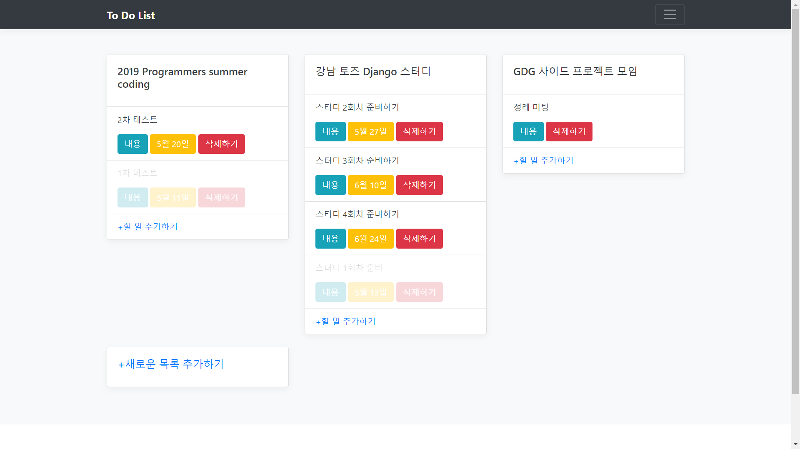

# 2019_summercoding_2nd_work

# Overview
> To Do List Project

BackEnd
- Python3
- Django 2.1
- SQLite3

FrontEnd
- Bootstrap 4

Deploy
- pythonanywhere

---
# 목차
1. 접속하여 테스트 가능한 URL
2. 리눅스 기준으로 실행하기 위해 필요한 설치 및 빌드 방법

---

1. [이 곳](http://jcjang.pythonanywhere.com/)에 접속하여 테스트할 수 있습니다.
- [pythonanywhere](https://www.pythonanywhere.com/) Paas를 이용하여 배포

---

2. 리눅스 기준으로 실행하기 위해 필요한 설치 및 빌드 방법
- git 설치
> $ sudo apt install git-all

- source code clone
> $ git clone https://github.com/jangjichang/2019_summercoding_2nd_work.git

- python3 설치
> $ sudo apt-get install python3

- pip 설치
> $ sudo apt install python3-pip

- virtualenv 설치
> $ sudo pip3 install virtualenv

- python3을 사용하는 가상 환경 'env' 만들기
> $ virtualenv --python=python3 env

- 가상환경 활성화
> $ source env/bin/activate

- 서버 실행을 위한 패키지 설치
> $ cd 2019_summercoding_2nd_work/ 
> $ pip install -r requirements.txt

- 서버 실행을 위한 설정
> $ cd src 
> $ mkdir db 
> $ python manage.py migrate 
> $ export summercoding_now_env=dev

- 서버 실행 명령어
> $ python manage.py runserver 127.0.0.1:8000 --insecure

- 이제 웹 브라우저를 통해 127.0.0.1:8000에 접속하여 확인할 수 있습니다.

